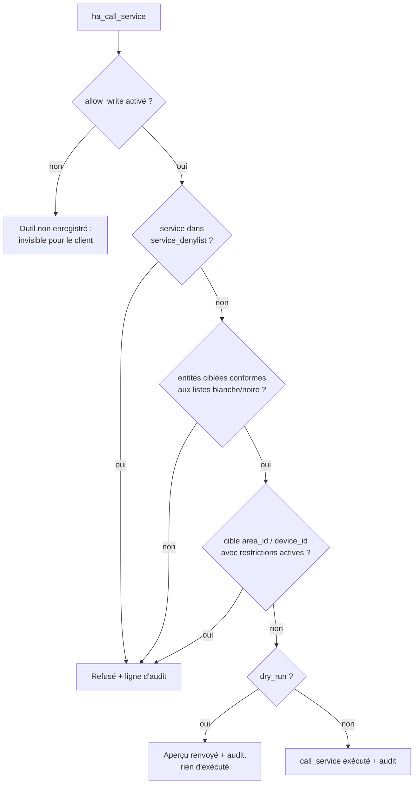

# Sécurité

Donner à un LLM l'accès à sa domotique mérite une vraie posture de sécurité. Cette page résume le modèle ; le document de référence est le [SECURITY.md](https://github.com/Devitek/mcp-ha/blob/main/SECURITY.md) du dépôt.

## Choix de conception

- **Lecture seule par défaut.** Avec `allow_write: false` (le défaut), l'outil d'écriture n'est pas enregistré : il n'apparaît pas du tout dans la liste des outils du client.
- **LAN uniquement.** HTTP en clair avec un jeton bearer statique. N'exposez pas le port 9583 sur internet ; pour un accès distant, passez par un VPN (WireGuard, Tailscale...).
- **Le jeton Supervisor ne quitte jamais l'add-on.** Les clients MCP s'authentifient avec leur propre jeton API ; aucun outil ne renvoie le moindre identifiant HA.

## Parcours d'une écriture

Chaque appel à `ha_call_service` traverse ce parcours :

Les lignes d'audit sont en JSON, une par tentative, et sont émises quel que soit le niveau de log configuré. Voir [Journalisation](/fr/reference/logging).

## Cycle de vie du jeton

- Généré au premier démarrage (32 octets aléatoires) quand `api_token` est vide.
- Persisté dans `/data/token` (mode 600), reporté dans les options de l'add-on, affiché à chaque démarrage dans le journal.
- Comparé en temps constant à chaque requête.
- Pour le renouveler : videz l'option `api_token`, supprimez `/data/token` (ou réinstallez), redémarrez.

## Limites assumées

- `ha_render_template` évalue du Jinja côté serveur : lecture seule, mais il peut lire l'état de **n'importe quelle** entité, `filter_reads` ne s'y applique pas.
- Le jeton présent dans les options se retrouve dans les sauvegardes de l'add-on, et visible des admins HA. Les journaux aussi.
- Pas de TLS : quiconque peut sniffer votre LAN peut lire le jeton. C'est le compromis du choix LAN uniquement.

## Signalement

Une vulnérabilité ? Utilisez les [advisories privées](https://github.com/Devitek/mcp-ha/security/advisories/new) plutôt qu'une issue publique.
