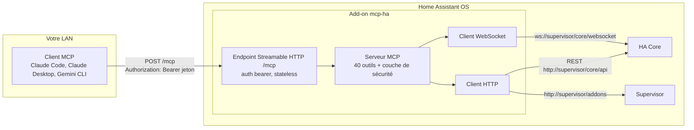
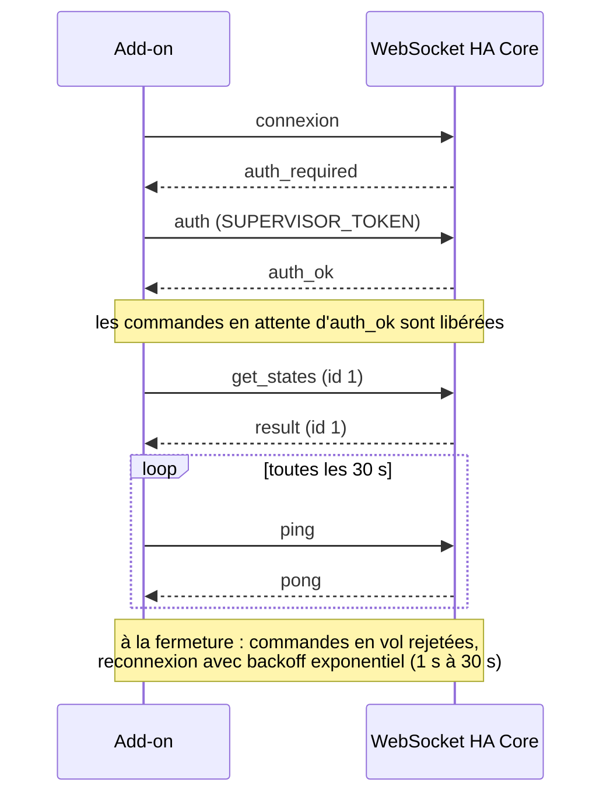
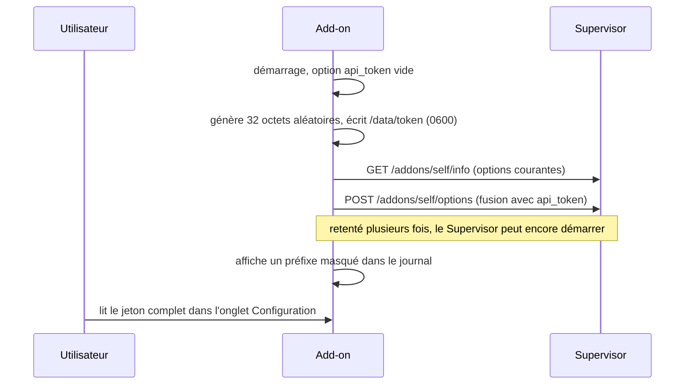

# Architecture

## Vue d'ensemble

L'add-on fait tourner un serveur Node 26 dans un conteneur géré par le Supervisor. Les clients MCP le joignent sur le LAN ; l'add-on parle à Home Assistant via le proxy interne du Supervisor, authentifié par le `SUPERVISOR_TOKEN` injecté dans le conteneur. Pas de jeton utilisateur, pas d'URL externe.



## WebSocket d'abord

L'**API WebSocket de HA est le canal principal** : états, services, registres (pièces, appareils, entités), historique, statistiques, logbook, appels de service. Une connexion persistante, des commandes corrélées par un `id` croissant.



Deux restes HTTP existent faute d'équivalent WebSocket :

| Besoin | Canal |
|--------|-------|
| Liste et détail des add-ons | API Supervisor `http://supervisor/addons` |
| Config YAML des automations/scripts | REST `GET /api/config/automation/config/<id>` |
| Rendu de template | REST `POST /api/template` (la commande WS est un abonnement, inadapté au one-shot stateless) |
| Journal d'erreurs HA | REST `GET /api/error_log` |

## Transport MCP : stateless par défaut, sessions en option

Le serveur implémente MCP en **Streamable HTTP**. Par défaut il est stateless : une instance de serveur MCP et un transport par requête, aucune session, ce qui rend l'endpoint trivialement compatible avec plusieurs clients simultanés et avec les redémarrages. `/health` est la seule route sans authentification.

Avec `enable_sessions` (#90), un `initialize` sans identifiant de session ouvre une **session longue** (en-tête `mcp-session-id`, flux SSE). Les sessions débloquent ce que le one-shot interdit structurellement :

- **Abonnements aux entités** : abonnez-vous à `ha://entity/{entity_id}` et recevez `notifications/resources/updated` quand elle change, alimenté par la carte d'états vivante (au plus une notification par seconde et par entité ; le client relit la resource).
- **Confirmations dans le protocole (elicitation)** : quand le client le gère, les appels sur domaines sensibles et les écritures de config interrogent l'humain directement via `elicitation/create` au lieu de faire transiter un `confirm_token` par le modèle. Le flux à jeton reste le repli universel.

Les requêtes stateless continuent de fonctionner telles quelles à côté des sessions.

**Cycle de vie et mémoire** (dimensionné pour un Pi) : au plus 16 sessions simultanées (503 au-delà, les clients peuvent retomber en stateless), les sessions inactives sont fermées après 30 minutes (balayage chaque minute), `DELETE /mcp` en termine une explicitement. Une session est liée au jeton API qui l'a ouverte : présenter un autre jeton valide dessus répond 403. Chaque session porte une instance de serveur MCP, un transport, un ensemble d'URIs abonnées (plafonné à 50) et un écouteur `state_changed`, tous libérés à la fermeture ; le coût marginal par session est de quelques dizaines de kilo-octets, négligeable devant la carte d'états.

## Discipline de contexte

Les réponses des outils sont pensées pour la consommation par un LLM :

- projection par défaut : les listes renvoient des champs minimaux, le détail vit dans `ha_get_entity` ;
- enveloppe standard avec `total`, `has_more`, `next_offset` ;
- `ha_list_entities` sans filtre renvoie un histogramme, pas un dump ;
- fenêtres temporelles bornées, sous-échantillonnage au-delà de 250 points d'historique ;
- plafond global d'environ 15 Ko par réponse, avec une note expliquant comment affiner.

## Bootstrap du jeton



## Caches

Les registres pièces, appareils, entités, étages et labels sont mis en cache avec partage des requêtes en vol et **invalidés par les événements de registre** (`area_registry_updated` et consorts) : un renommage est visible à l'appel suivant. Un TTL de 60 secondes reste en filet de sécurité si un abonnement échoue silencieusement. **Les états sont une carte vivante** alimentée par un abonnement `state_changed` (v0.3) : l'add-on s'abonne d'abord, prend un instantané via un seul `get_states`, rejoue les événements tamponnés entre-temps, et sert toutes les lectures depuis la mémoire. L'abonnement est rétabli à chaque reconnexion ; s'il échoue, un repli en TTL court garde les outils fonctionnels.

## Page de statut

`ingress: true` expose une page de statut et d'onboarding dans la barre latérale de Home Assistant (authentifiée par la session HA, port interne au réseau du conteneur) : version, uptime, état du WebSocket, options actives, et des configs client prêtes à copier avec le jeton API masqué par défaut (même périmètre de confiance que l'onglet Configuration ; le jeton Supervisor n'y apparaît jamais). Depuis la 0.19.0 elle affiche aussi les compteurs d'usage (appels par jeton depuis le démarrage) et les dernières lignes d'audit, visibles par l'humain seulement : le contrat de #91 tient, les clients MCP ne peuvent jamais lire l'audit.

## Organisation du dépôt

```
mcp-ha/
├── mcp_ha/            # l'add-on (contexte de build Docker autonome)
│   ├── config.yaml    # manifest (options, schéma, ports, permissions)
│   ├── Dockerfile     # multi-stage : build node:26-alpine, runtime base HA
│   ├── run.sh         # entrypoint bashio
│   └── src/           # serveur TypeScript (SDK MCP, ws, zod)
├── docs/              # ce site (VitePress, en + fr)
└── .github/workflows/ # CI, release (images multi-arch), déploiement du site
```
