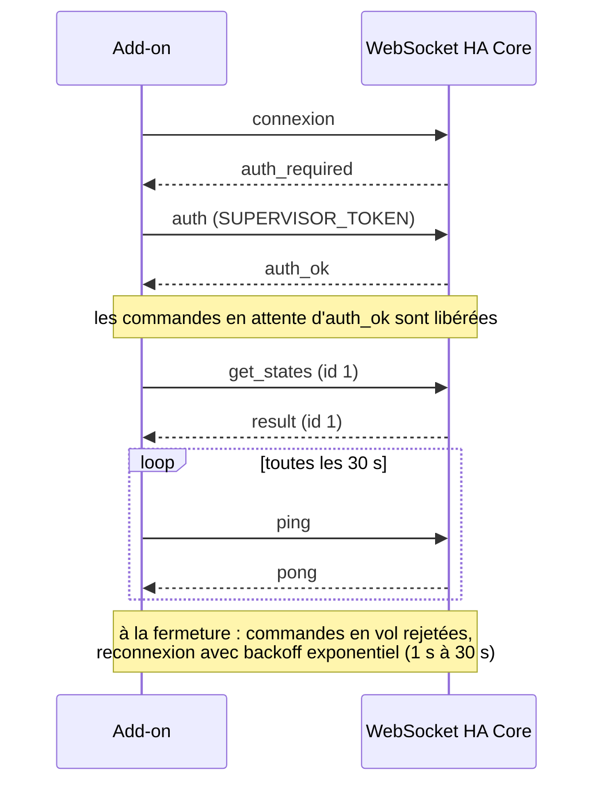
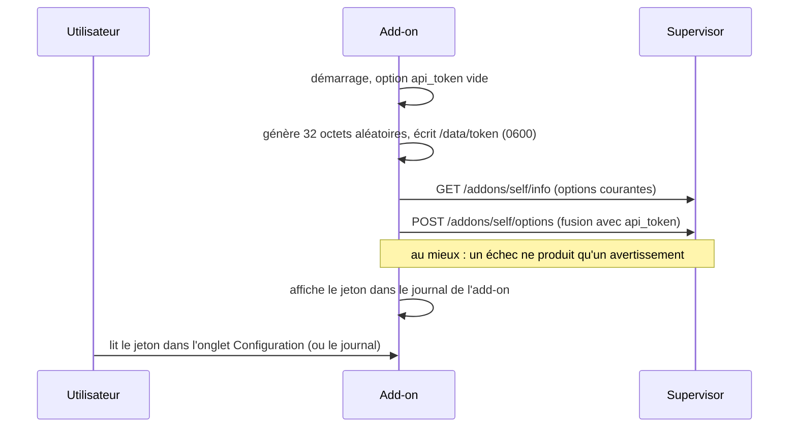

# Architecture

## Vue d'ensemble

L'add-on fait tourner un serveur Node 26 dans un conteneur géré par le Supervisor. Les clients MCP le joignent sur le LAN ; l'add-on parle à Home Assistant via le proxy interne du Supervisor, authentifié par le `SUPERVISOR_TOKEN` injecté dans le conteneur. Pas de jeton utilisateur, pas d'URL externe.


## WebSocket d'abord

L'**API WebSocket de HA est le canal principal** : états, services, registres (pièces, appareils, entités), historique, statistiques, logbook, appels de service. Une connexion persistante, des commandes corrélées par un `id` croissant.



Deux restes HTTP existent faute d'équivalent WebSocket :

| Besoin | Canal |
|--------|-------|
| Liste et détail des add-ons | API Supervisor `http://supervisor/addons` |
| Config YAML des automations/scripts | REST `GET /api/config/automation/config/<id>` |
| Rendu de template | REST `POST /api/template` (la commande WS est un abonnement, inadapté au one-shot stateless) |
| Journal d'erreurs HA | REST `GET /api/error_log` |

## Transport MCP stateless

Le serveur implémente MCP en **Streamable HTTP** en mode stateless : une instance de serveur MCP et un transport par requête, aucune session. L'endpoint est ainsi trivialement compatible avec plusieurs clients simultanés et avec les redémarrages. `GET /mcp` répond 405 ; `/health` est la seule route sans authentification.

## Discipline de contexte

Les réponses des outils sont pensées pour la consommation par un LLM :

- projection par défaut : les listes renvoient des champs minimaux, le détail vit dans `ha_get_entity` ;
- enveloppe standard avec `total`, `has_more`, `next_offset` ;
- `ha_list_entities` sans filtre renvoie un histogramme, pas un dump ;
- fenêtres temporelles bornées, sous-échantillonnage au-delà de 250 points d'historique ;
- plafond global d'environ 15 Ko par réponse, avec une note expliquant comment affiner.

## Bootstrap du jeton



## Cache des registres

Pièces, appareils et registre d'entités changent rarement : cache de 60 secondes. Les états sont toujours lus en direct (un seul aller-retour WS). Une version future maintiendra un cache d'états vivant alimenté par `subscribe_events`.

## Organisation du dépôt

```
mcp-ha/
├── mcp_ha/            # l'add-on (contexte de build Docker autonome)
│   ├── config.yaml    # manifest (options, schéma, ports, permissions)
│   ├── Dockerfile     # multi-stage : build node:26-alpine, runtime base HA
│   ├── run.sh         # entrypoint bashio
│   └── src/           # serveur TypeScript (SDK MCP, ws, zod)
├── docs/              # ce site (VitePress, en + fr)
└── .github/workflows/ # CI, release (images multi-arch), déploiement du site
```
