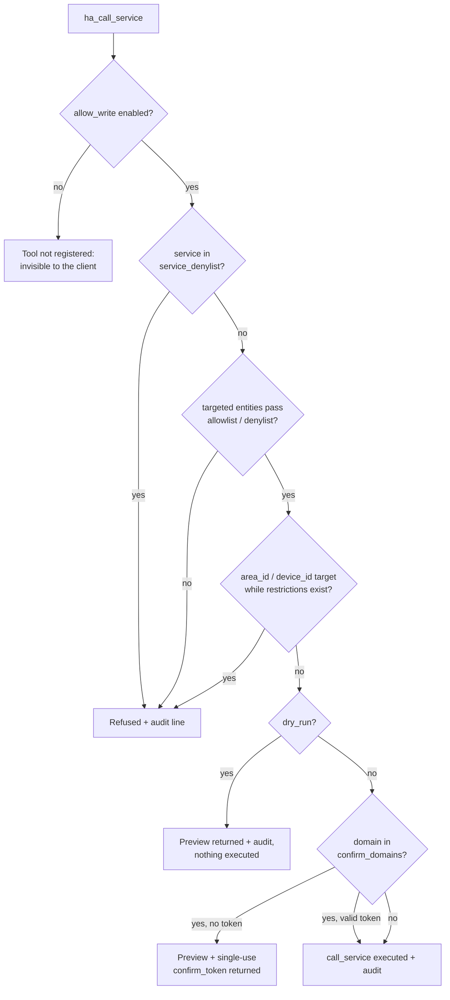

# Security

Giving an LLM access to your home automation deserves a real security posture. This page summarizes the model; the authoritative document is [SECURITY.md](https://github.com/Devitek/mcp-ha/blob/main/SECURITY.md) in the repository.

## Design choices

- **Read only by default.** With `allow_write: false` (the default), the write tool is not registered: it does not appear in the client's tool list at all.
- **LAN only.** Plain HTTP with a static bearer token. Do not expose port 9583 to the internet; for remote access use a VPN (WireGuard, Tailscale...).
- **The Supervisor token never leaves the add-on.** MCP clients authenticate with their own API token; no tool returns any HA credential.

## Write path

The four write tools (`ha_call_service`, `ha_run_script`, `ha_trigger_automation`, `ha_set_automation`) share one guarded path; every call goes through this gauntlet:

The audit lines are JSON, one per attempt, and are emitted regardless of the configured log level. See [Logging](/reference/logging).

## Token lifecycle

- Generated on first start (32 random bytes) when `api_token` is empty.
- Persisted in `/data/token` (mode 600) and written back into the add-on options. The log never shows it in full: only a masked prefix with fixed-length padding (`d370f4f8**********`), so neither the value nor its length leaks.
- Compared in constant time on every request.
- To rotate: clear the `api_token` option, delete `/data/token` (or reinstall), restart, then update your clients.

::: warning Versions before 0.1.4
Add-on versions 0.1.0 to 0.1.3 printed the token in full in the add-on log. If you ever shared logs produced by those versions (issue, forum, screenshot), rotate your token now.
:::

## Other guard rails

- After 5 failed authentications, an IP is progressively blocked (up to 60 s, HTTP 429 with `Retry-After`); a user-set token shorter than 16 characters triggers a loud startup warning.
- The Node server runs as a dedicated unprivileged user inside the container, confined by a custom AppArmor profile that denies `/etc/shadow`, writes outside `/data`, and privilege escalation. The profile was validated on a real AppArmor-enforcing host.

## Accepted limitations

- `ha_render_template` evaluates Jinja server-side and can read **any** entity state: it is therefore disabled entirely when `filter_reads` is enabled.
- The token being in the options means it is included in add-on backups, and visible to HA admins. So are the logs.
- No TLS: anyone able to sniff your LAN traffic can read the token. That is the LAN-only tradeoff.

## Reporting

Found a vulnerability? Please use [private security advisories](https://github.com/Devitek/mcp-ha/security/advisories/new) rather than a public issue.
