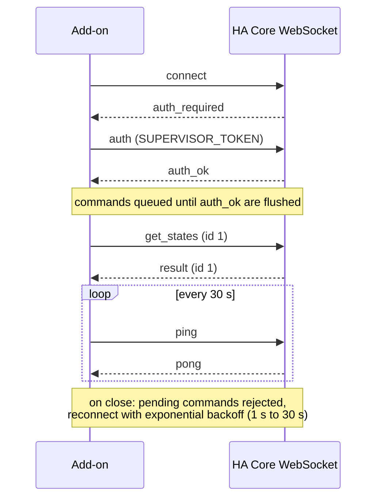
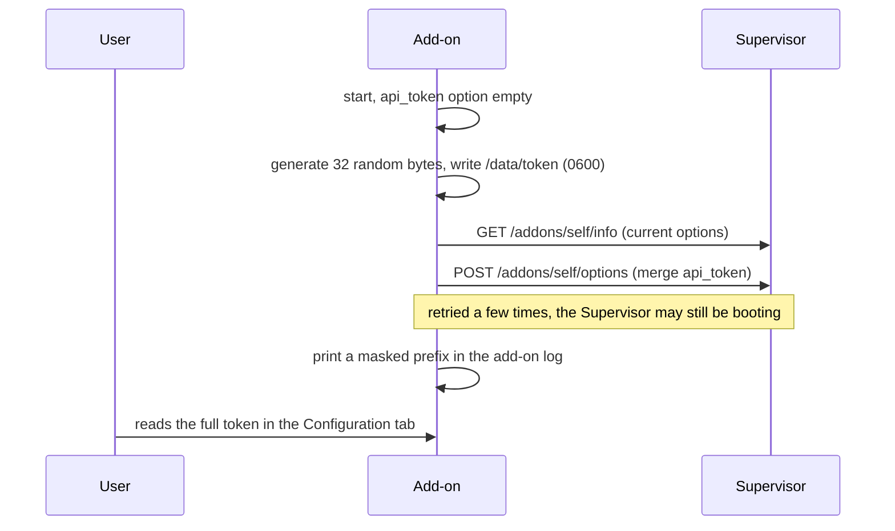

# Architecture

## Overview

The add-on runs a Node 26 server inside a Supervisor-managed container. MCP clients reach it over the LAN; the add-on talks to Home Assistant through the Supervisor's internal proxy, authenticated with the `SUPERVISOR_TOKEN` injected into the container. No user token, no external URL.


## WebSocket-first

The HA **WebSocket API is the primary channel**: states, services, registries (areas, devices, entities), history, statistics, logbook, service calls. One persistent connection, commands correlated by a monotonically increasing `id`.



Two HTTP leftovers exist because they have no WebSocket equivalent:

| Need | Channel |
|------|---------|
| Add-on list and details | Supervisor API `http://supervisor/addons` |
| Automation/script YAML config | REST `GET /api/config/automation/config/<id>` |
| Template rendering | REST `POST /api/template` (the WS command is a subscription, unsuited to one-shot stateless calls) |
| HA error log | REST `GET /api/error_log` |

## MCP transport: stateless by default, sessions opt-in

The server implements MCP over **Streamable HTTP**. By default it is stateless: one MCP server instance and one transport per request, no session, which makes the endpoint trivially compatible with multiple simultaneous clients and with restarts. `/health` is the only unauthenticated route.

With `enable_sessions` (#90), an `initialize` without a session id opens a **long-lived session** (`mcp-session-id` header, SSE streams). Sessions unlock what one-shot requests structurally cannot do:

- **Entity subscriptions**: subscribe to `ha://entity/{entity_id}` and receive `notifications/resources/updated` when it changes, fed by the live state map (at most one notification per second per entity; the client re-reads the resource).
- **In-protocol confirmations (elicitation)**: when the client supports it, sensitive-domain calls and config writes ask the human directly through `elicitation/create` instead of round-tripping a `confirm_token` through the model. The token flow remains the universal fallback.

Stateless requests keep working unchanged alongside sessions.

**Session lifecycle and memory** (designed for a Pi): at most 16 simultaneous sessions (503 beyond, clients can fall back to stateless), idle sessions are closed after 30 minutes (swept every minute), `DELETE /mcp` ends one explicitly. A session is bound to the API token that opened it: presenting another valid token on it answers 403. Each session holds one MCP server instance, one transport, a set of subscribed URIs (capped at 50) and one `state_changed` listener, all released on close; the marginal cost per session is a few tens of kilobytes, negligible next to the live state map.

## Context-window discipline

Tool responses are designed for LLM consumption:

- projection by default: lists return minimal fields, details live in `ha_get_entity`;
- standard envelope with `total`, `has_more`, `next_offset`;
- unfiltered `ha_list_entities` returns a histogram, not a dump;
- bounded time windows, downsampling beyond 250 history points;
- global cap around 15 KB per response, with a note explaining how to refine.

## Token bootstrap



## Caches

Areas, devices, entities, floors and labels registries are cached with shared in-flight fetches and **invalidated by the registry events** (`area_registry_updated` and friends): a rename is visible on the next call. A 60-second TTL remains as a safety net if a subscription silently fails. **States are a live map** fed by a `state_changed` subscription (v0.3): the add-on subscribes first, snapshots with one `get_states`, replays the events buffered in between, and serves every read from memory. The subscription is re-established on every reconnection; if it fails, a short-TTL fetch fallback keeps the tools working.

## Status page

`ingress: true` exposes a status and onboarding page in the Home Assistant sidebar (authenticated by the HA session, port internal to the container network): version, uptime, WebSocket state, active options, and ready-to-copy client configs with the API token masked by default (same trust boundary as the Configuration tab; the Supervisor token never appears). Since 0.19.0 it also shows usage counters (tool calls per token since start) and the last audit entries, human-visible only: the #91 contract stands, MCP clients can never read the audit.

## Repository layout

```
mcp-ha/
├── mcp_ha/            # the add-on (self-contained Docker build context)
│   ├── config.yaml    # manifest (options, schema, ports, permissions)
│   ├── Dockerfile     # multi-stage: node:26-alpine build, HA base runtime
│   ├── run.sh         # bashio entrypoint
│   └── src/           # TypeScript server (MCP SDK, ws, zod)
├── docs/              # this site (VitePress, en + fr)
└── .github/workflows/ # CI, release (multi-arch images), docs deploy
```
