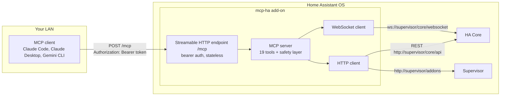
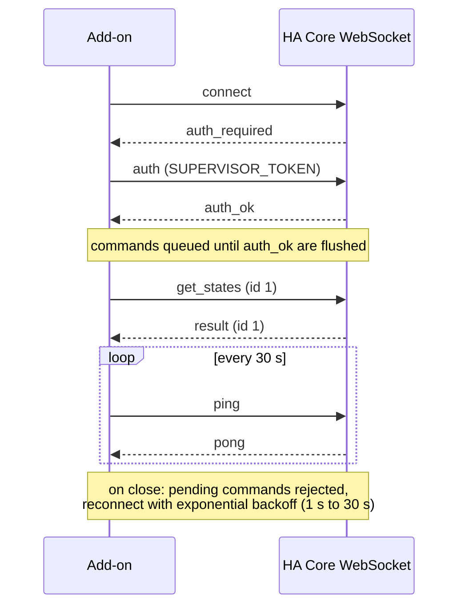
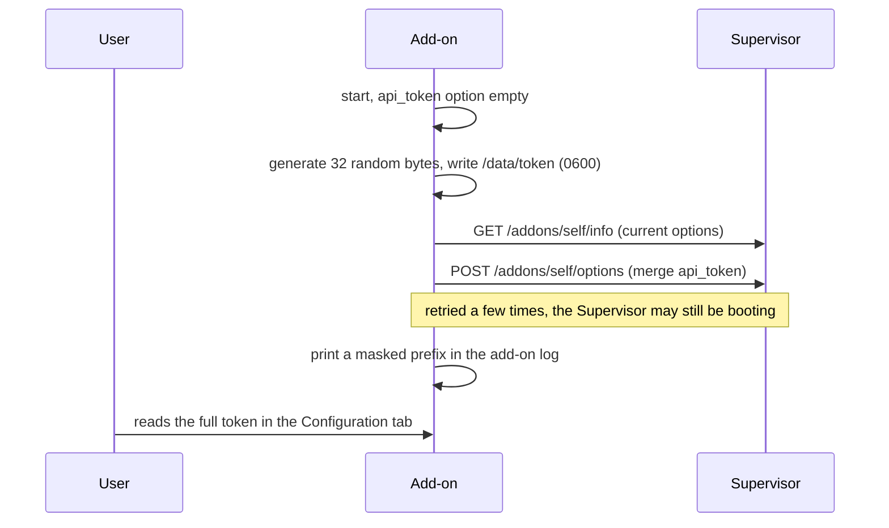

# Architecture

## Overview

The add-on runs a Node 26 server inside a Supervisor-managed container. MCP clients reach it over the LAN; the add-on talks to Home Assistant through the Supervisor's internal proxy, authenticated with the `SUPERVISOR_TOKEN` injected into the container. No user token, no external URL.



## WebSocket-first

The HA **WebSocket API is the primary channel**: states, services, registries (areas, devices, entities), history, statistics, logbook, service calls. One persistent connection, commands correlated by a monotonically increasing `id`.



Two HTTP leftovers exist because they have no WebSocket equivalent:

| Need | Channel |
|------|---------|
| Add-on list and details | Supervisor API `http://supervisor/addons` |
| Automation/script YAML config | REST `GET /api/config/automation/config/<id>` |
| Template rendering | REST `POST /api/template` (the WS command is a subscription, unsuited to one-shot stateless calls) |
| HA error log | REST `GET /api/error_log` |

## Stateless MCP transport

The server implements MCP over **Streamable HTTP** in stateless mode: one MCP server instance and one transport per request, no session. That makes the endpoint trivially compatible with multiple simultaneous clients and with restarts. `GET /mcp` answers 405; `/health` is the only unauthenticated route.

## Context-window discipline

Tool responses are designed for LLM consumption:

- projection by default: lists return minimal fields, details live in `ha_get_entity`;
- standard envelope with `total`, `has_more`, `next_offset`;
- unfiltered `ha_list_entities` returns a histogram, not a dump;
- bounded time windows, downsampling beyond 250 history points;
- global cap around 15 KB per response, with a note explaining how to refine.

## Token bootstrap



## Registry cache

Areas, devices and entity registries change rarely: they are cached for 60 seconds. States are always fetched live (a single WS round-trip). A future version will maintain a live state cache fed by `subscribe_events`.

## Repository layout

```
mcp-ha/
├── mcp_ha/            # the add-on (self-contained Docker build context)
│   ├── config.yaml    # manifest (options, schema, ports, permissions)
│   ├── Dockerfile     # multi-stage: node:26-alpine build, HA base runtime
│   ├── run.sh         # bashio entrypoint
│   └── src/           # TypeScript server (MCP SDK, ws, zod)
├── docs/              # this site (VitePress, en + fr)
└── .github/workflows/ # CI, release (multi-arch images), docs deploy
```
